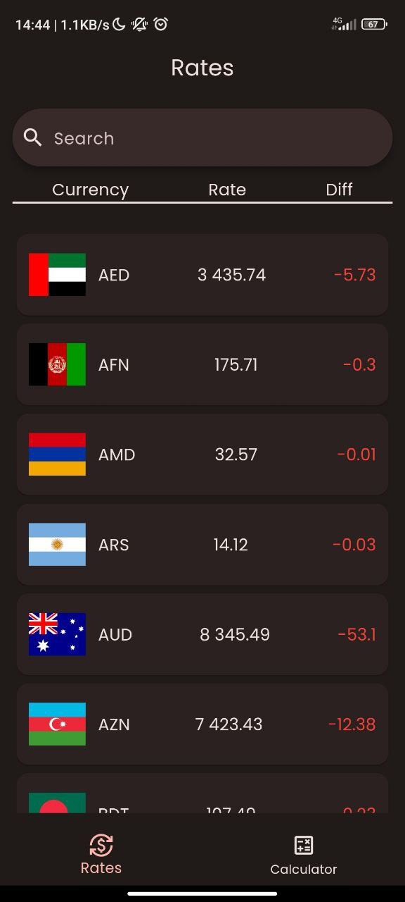
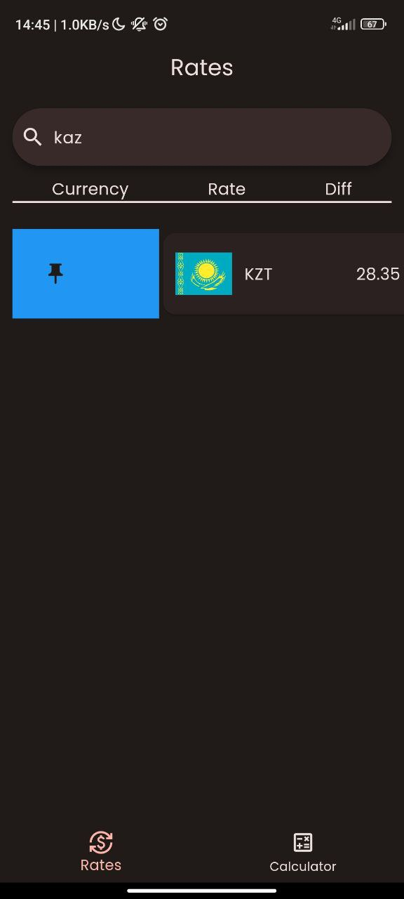
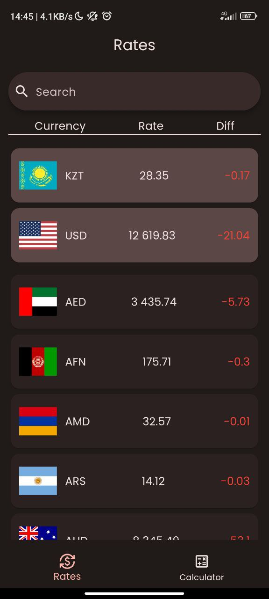
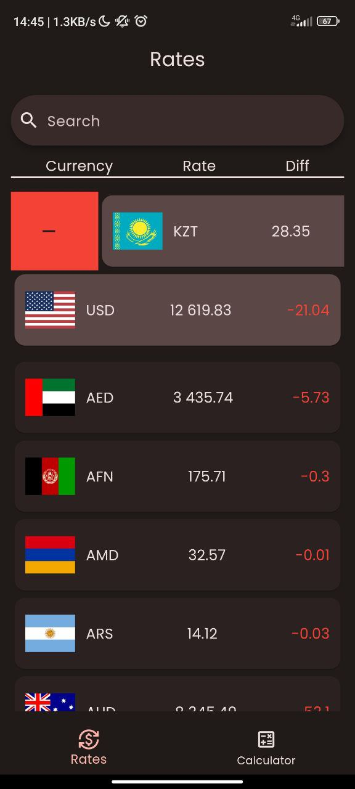
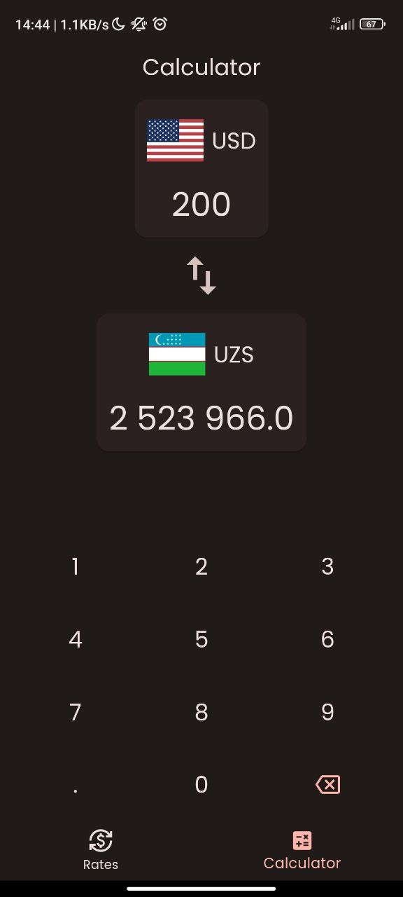
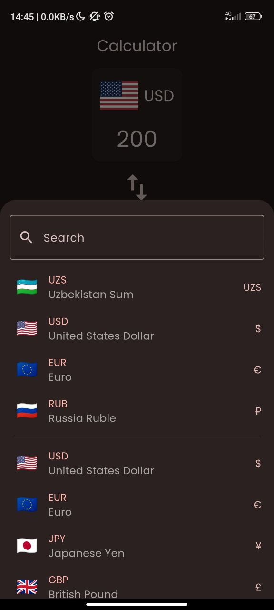
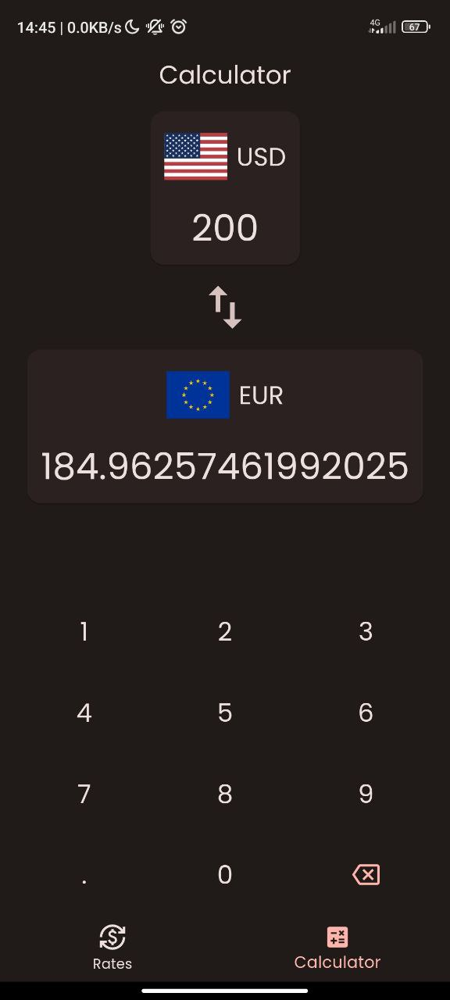
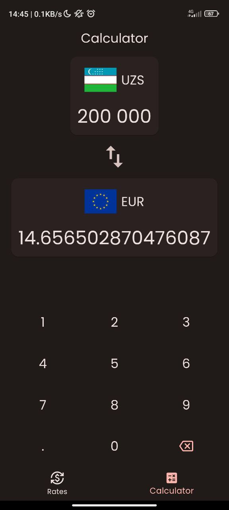

# Currency UZ

Currency UZ is a Flutter application designed to provide up-to-date currency exchange rates from the Central Bank of Uzbekistan. The app also features a calculator screen that allows users to convert currencies easily. The state is managed using Cubit, API interactions are handled with the http library, and caching is implemented with Hive.

## Screenshots

  
  
  
  
  
  
  
  

## Core Features Implementation

### Fetching Currency Rates from API
The app fetches real-time currency exchange rates from the Central Bank of Uzbekistan using an API. This ensures users have the latest information at their fingertips.

**API Endpoint**: `https://cbu.uz/ru/arkhiv-kursov-valyut/json/`

### Currency Conversion Calculator
The app includes a calculator screen that allows users to convert amounts between different currencies. Users can input the amount they wish to convert and select the desired currencies to see the converted amount instantly.

### State Management with Cubit
The app utilizes the Bloc(Cubit) pattern for state management. Each feature module, such as fetching currency rates and performing conversions, has its own Cubit responsible for managing its state. This ensures a clean and organized codebase with clear separation of concerns.

### Caching with Hive
To improve performance and reduce the need for frequent API calls, the app caches currency data using Hive. This allows the app to work efficiently even when the network connectivity is poor or unavailable.

## Development
The core features of Currency UZ are implemented using Flutter and various packages to simplify development and enhance user experience. Here are the key technologies used:
- **State Management**: Bloc(Cubit)
- **API Library**: http
- **Caching**: Hive database

## Contributing
Contributions are welcome! Please fork the repository and submit a pull request for any feature enhancements or bug fixes.

## Contact

For any inquiries, please contact [aisroilov1029@gmail.com](aisroilov1029gmail.com).
